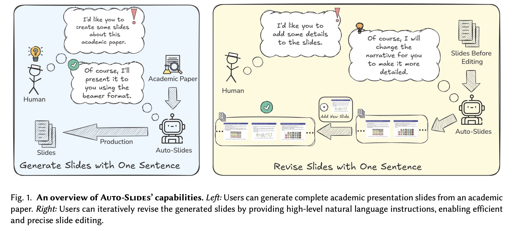
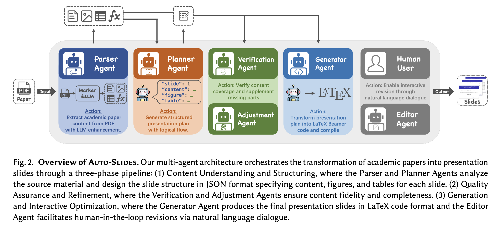

<p align="center">
  <h1 align="center">Auto-Slides: Automatic Academic Presentation Generation with Multi-Agent Collaboration</h1>
  <p align="center">
    <strong>Yuheng Yang</strong><sup>1</sup>
    &nbsp;&nbsp;
    <strong>Wenjia Jiang</strong><sup>1</sup>
    &nbsp;&nbsp;
    <strong>Yang Wang</strong><sup>1</sup>
    &nbsp;&nbsp;
    <strong>Yiwei Wang</strong><sup>2</sup>
    &nbsp;&nbsp;
    <strong>Chi Zhang</strong><sup>1</sup><sup>*</sup>
    <br>
    <sup>1</sup>AGI Lab, Westlake University&nbsp;
    <sup>2</sup>University of California at Merced
    <br>
    <a href="mailto:yangyuheng@westlake.edu.cn">yangyuheng@westlake.edu.cn</a>
    <br>
    <a href='https://arxiv.org/abs/2509.11062'></a>&nbsp;
    <a href='https://auto-slides.github.io/'></a>&nbsp;
    <a href='https://github.com/wzsyyh/Auto-Slides'></a>&nbsp;
    <br>
    
  </p>
  <br>
</p>

Auto-Slides is an intelligent system that automatically converts academic research papers into well-structured, pedagogically optimized presentation slides. Built on large language models and cognitive science principles, it creates multimodal presentations with interactive customization capabilities.

## 🏗️ System Architecture



## 🚀 Features

- **Intelligent PDF Processing**: Automatically extracts text, figures, tables, and structure from research papers using advanced OCR and layout analysis
- **Multi-Agent Framework**: Employs specialized agents for content extraction, presentation planning, verification, and repair
- **Interactive Customization**: Supports real-time refinement through natural language dialogue
- **Pedagogical Optimization**: Creates presentation-oriented narratives that enhance learning and comprehension
- **Multimodal Output**: Generates slides with proper figure placement, table formatting, and code syntax highlighting
- **Multiple Themes**: Supports various Beamer themes (Madrid, Berlin, Singapore, etc.)
- **Bilingual Support**: Works with both English and Chinese papers
- **Speech Generation**: Optional accompanying speech script generation

## 📋 Requirements

- Python 3.8+
- LaTeX environment (TeX Live or MiKTeX)
- OpenAI API key
- 8GB+ RAM (for marker-pdf model)

## 🛠️ Installation

### 1. Clone the Repository

```bash
git clone https://github.com/Westlake-AGI-Lab/Auto-Slides.git
cd auto-slides
```

### 2. Create Virtual Environment (Recommended)

```bash
python -m venv venv
source venv/bin/activate  # Linux/Mac
# or
venv\Scripts\activate  # Windows
```

### 3. Install Dependencies

```bash
pip install -r requirements.txt
```

### 4. Download Required Models

**Important**: Download the marker-pdf model for PDF processing:

```bash
python down_model.py
```

This will download the marker-pdf model to the `models/` directory (~2GB).

### 5. Configure API Keys

**Option 1: Use the provided template (Recommended)**

Rename the provided template file and add your API key:

```bash
# Rename the template file
mv ".env copy" .env

# Edit the .env file and add your OpenAI API key
nano .env  # or use your preferred editor
```

**Option 2: Create from scratch**

Create a `.env` file in the project root:

```env
# OpenAI API Configuration (Required)
OPENAI_API_KEY=your_openai_api_key_here

# Optional: LangSmith for monitoring (uncomment if needed)
# LANGCHAIN_TRACING_V2="true"
# LANGCHAIN_ENDPOINT="https://api.smith.langchain.com"
# LANGCHAIN_API_KEY="your_langsmith_api_key_here"
# LANGCHAIN_PROJECT="auto-slides"
```

> **Note**: The `.env copy` file contains a template with all available configuration options. Simply rename it to `.env` and update the `OPENAI_API_KEY` value with your actual API key.

## 🎯 Quick Start

### Basic Usage

Convert a research paper to presentation slides:

```bash
python main.py path/to/your/paper.pdf
```

### Advanced Options

```bash
python main.py path/to/your/paper.pdf \
    --language en \
    --model gpt-4o \
    --theme Madrid \
    --output-dir output \
    --verbose
```

### Disable Interactive Revision

By default, Auto-Slides enables interactive revision after generating slides. To disable this feature:

```bash
python main.py path/to/your/paper.pdf --no-interactive-revise
```

### Revision Mode

Modify existing presentations with feedback:

```bash
python main.py --revise \
    --original-plan=path/to/plan.json \
    --previous-tex=path/to/output.tex \
    --feedback="Please make the title more prominent"
```

## 📖 Command Line Options

### Required Arguments
- `pdf_path`: Path to the input PDF file

### Optional Arguments

#### Basic Options
- `--output-dir, -o`: Output directory (default: `output`)
- `--language, -l`: Output language (`zh` or `en`, default: `en`)
- `--model, -m`: Language model to use (default: `gpt-4o`)
- `--theme`: Beamer theme (default: `Madrid`)
- `--verbose, -v`: Show verbose logs

#### Processing Options
- `--disable-llm-enhancement`: Use basic PDF parsing only
- `--skip-compilation, -s`: Generate TEX only, skip PDF compilation
- `--max-retries, -r`: Maximum retries for compilation (default: 5)

#### Interactive Features
- `--interactive, -i`: Enable interactive mode for presentation plan optimization
- `--no-interactive-revise`: Disable interactive revision after slide generation (enabled by default)

#### Verification & Repair
- `--enable-verification`: Enable content verification (default: enabled)
- `--enable-auto-repair`: Enable automatic content repair (default: enabled)
- `--disable-verification`: Disable verification and repair (fast mode)

#### Speech Generation
- `--enable-speech`: Generate accompanying speech script
- `--speech-duration`: Target speech duration in minutes (default: 15)
- `--speech-style`: Speech style (`academic_conference`, `classroom`, `industry_presentation`, `public_talk`)

#### Revision Mode
- `--revise, -R`: Enable revision mode
- `--original-plan`: Path to original presentation plan JSON
- `--previous-tex`: Path to previous TEX file
- `--feedback`: User feedback for modifications

## 📁 Output Structure

The system generates organized output in the specified directory:

```
output/
├── raw/<session_id>/          # Extracted PDF content
├── plan/<session_id>/         # Presentation plans (JSON)
├── tex/<session_id>/          # Generated LaTeX files and PDFs
├── images/<session_id>/       # Extracted figures and tables
├── verification/<session_id>/ # Verification reports
├── repair/<session_id>/       # Auto-repair results
└── speech/<session_id>/       # Generated speech scripts
```

## 🔧 System Architecture

Auto-Slides employs a sophisticated multi-agent framework with the following components:

1. **PDF Parser**: Extracts content using marker-pdf and OCR technologies
2. **Presentation Planner**: Generates structured presentation plans based on cognitive science principles
3. **Verification Agent**: Ensures content coverage and accuracy through automated validation
4. **Repair Agent**: Automatically fixes identified issues and improves content completeness
5. **TEX Generator**: Creates high-quality LaTeX Beamer code with proper formatting
6. **Interactive Editor**: Enables real-time customization through natural language dialogue

The system processes research papers through multiple stages, from initial content extraction to final presentation generation, with built-in quality assurance and user interaction capabilities.

## 🎨 Supported Themes

- Madrid (default)
- Berlin
- Singapore
- Warsaw
- Copenhagen
- And more Beamer themes

## 🌍 Language Support

- **English**: Full support with optimized prompts
- **Chinese**: Full support with Chinese-specific processing

## ⚠️ Troubleshooting

### Common Issues

**Q: Images not extracted or missing?**
- Ensure the marker-pdf model is downloaded: `python down_model.py`
- Check that images exist in `output/images/<session_id>/`

**Q: API key not working?**
- Verify `OPENAI_API_KEY` is set in your `.env` file
- Check your OpenAI account has sufficient credits

**Q: LaTeX compilation fails?**
- Ensure LaTeX is installed and `pdflatex` is in your PATH
- The system automatically uses `-shell-escape` for code highlighting

**Q: Memory issues with large PDFs?**
- The marker-pdf model requires ~8GB RAM
- Consider using `--disable-llm-enhancement` for basic processing

### Performance Tips

- Use `--disable-verification` for faster processing
- Enable `--skip-compilation` to generate TEX only
- Use `--no-interactive-revise` to skip interactive features

## 📚 Citation

If you use Auto-Slides in your research, please cite our paper:

```bibtex
@article{yang2025autoslides,
  title={Auto-Slides: Automatic Academic Presentation Generation with Multi-Agent Collaboration},
  author={Yang, Yuheng and Jiang, Wenjia and Wang, Yang and Wang, Yiwei and Zhang, Chi},
  journal={arXiv preprint arXiv:2509.11062},
  year={2025},
  note={AGI Lab, Westlake University; University of California at Merced; Corresponding author: Chi Zhang},
  url={https://auto-slides.github.io/},
  eprint={2509.11062},
  archivePrefix={arXiv},
  primaryClass={cs.AI}
}
```

## 📄 License

This project is licensed under the MIT License - see the [LICENSE](LICENSE) file for details.

## 🤝 Contributing

Contributions are welcome! Please feel free to submit a Pull Request.

## 📞 Contact

- **Project Page**: [auto-slides.github.io](https://auto-slides.github.io/)
- **Paper**: [arXiv:2509.11062](https://arxiv.org/abs/2509.11062)
- **Issues**: [GitHub Issues](https://github.com/wzsyyh/Auto-Slides/issues)
- **Email**: yangyuheng@westlake.edu.cn

## 🙏 Acknowledgments

- [marker-pdf](https://modelscope.cn/models/Lixiang/marker-pdf/summary) for PDF processing
- [OpenAI](https://openai.com/) for language models
- [LangChain](https://langchain.com/) for LLM orchestration
- [Beamer](https://ctan.org/pkg/beamer) for presentation framework